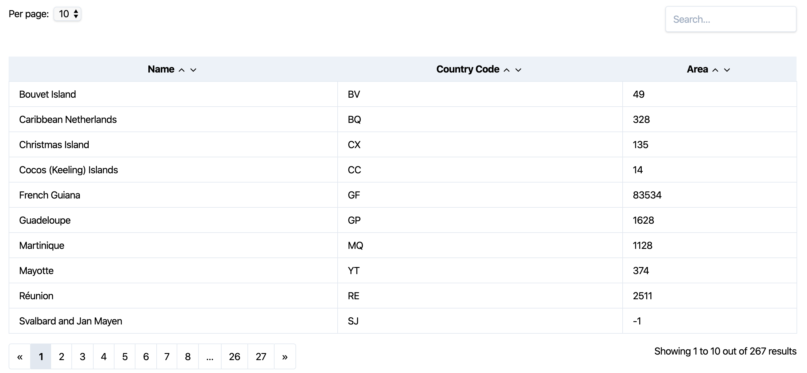

[](https://packagist.org/packages/codedge/livewire-companion)
[](https://packagist.org/packages/codedge/livewire-companion)
[](https://packagist.org/packages/codedge/livewire-companion)

# Livewire Companion 

[_Livewire Companion_](https://www.livewire-companion.tech) is a set of components based on [Laravel Livewire](https://laravel-livewire.com/), to get you quickly
up and running for recurring tasks.

## Included components

All components use the brilliant [Tailwind CSS](https://tailwindcss.com/). :rocket:  
<br>
**Currently included components are:**

* Datatable
  * Search over one column
  * Sorting of columns
  * Pagination
  * Indicators for pages and total records
  * Items per page



* Map (_coming soon_)

## How to install

You can install the package via composer:

```bash
$ composer require codedge/livewire-companion
```

The package will automatically register itself. Then publish the assets (configuration and templates):

```bash
$ php artisan vendor:publish --provider="Codedge\LivewireCompanion\LivewireCompanionServiceProvider"
```

This is going to publish all templates to `resources/views/vendor/livewire-companion`. Feel free to modify to your needs.

## How to use

### Datatables

The datatable component support both, [Eloquent collections](https://laravel.com/docs/5.8/eloquent-collections)
and [Support collections](https://laravel.com/docs/5.8/collections).  

Create a new file at `app/Http/Livewire/MyTable.php`:

```php
<?php declare(strict_types=1);
// ...
use Codedge\LivewireCompanion\Components\Datatable;

class MyTable extends Datatable
{
    protected $model = User::class;
    // ...
}
```

The Livewire component needs to inherit the `Datatable` class. Then make sure you configure the component as you like:  

* `$model`: Specify the model class, _mandatory_
* `$perPageOptions`: Available options show items per page, _default_: `5, 10, 25`
* `$searchingEnabled`: Enable/Disable searching, _default_: `true`
* `$sortingEnabled`: Enable/Disable sorting, _default_: `true`
* `$template`: Overwrite Datatable template path, _default_: `vendor.livewire-companion.datatable`

## Contributing

If you miss any component or want to extend functionality and/or fixing bugs - feel free to submit a PR. I happily merge it in.
